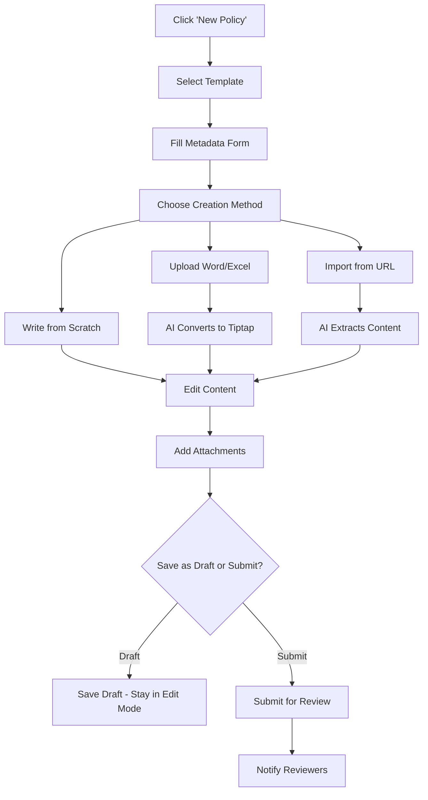
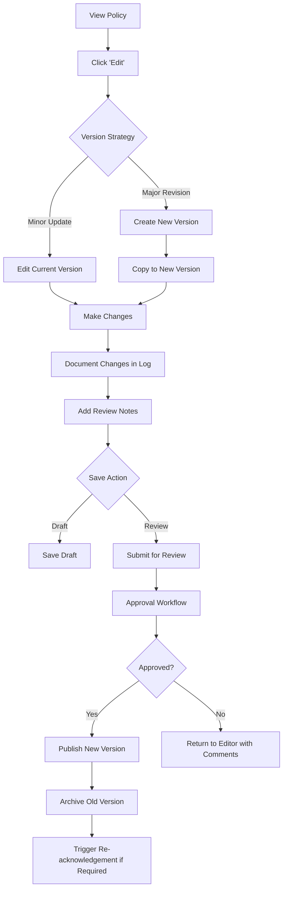
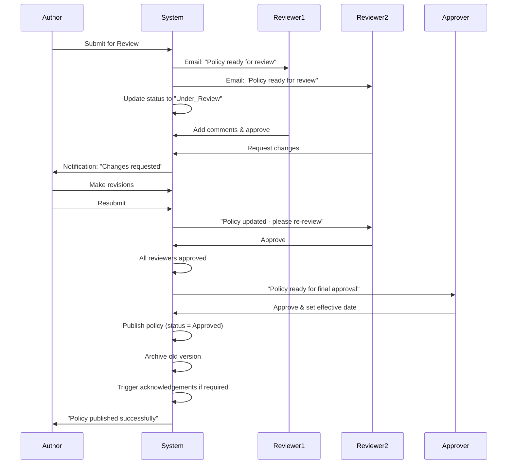

# POLICY & SOP VIEWING AND EDITING - UX DESIGN DOCUMENT

## **2. VIEWING INTERFACE**

### **2.1 Main Policy Library - Layout**

```
┌─────────────────────────────────────────────────────────────────────────────┐
│  Policies & SOPs                                    [+ New Policy] [⚙️ Settings]│
├─────────────────────────────────────────────────────────────────────────────┤
│                                                                             │
│  ┌──────────────────┐  ┌────────────────────────────────────────────┐     │
│  │  QUICK FILTERS   │  │  [🔍 Search policies...]         [Filter ▼]│     │
│  │                  │  │                                              │     │
│  │  ☑ Active        │  │  ┌─────────────────────────────────────┐  │     │
│  │  ☐ Draft         │  │  │ View: [List ▼] [Grid] [Table]      │  │     │
│  │  ☐ Under Review  │  │  └─────────────────────────────────────┘  │     │
│  │  ☐ Archived      │  │                                              │     │
│  │                  │  │  Sort by: [Recent ▼] [A-Z] [Category]      │     │
│  │  BY TYPE         │  └────────────────────────────────────────────┘     │
│  │  ☐ SOP (45)      │                                                      │
│  │  ☐ Policy (23)   │  ┌──────────────────────────────────────────┐      │
│  │  ☐ Work Inst(12) │  │ 📋 SOP-2024-FS-001                       │      │
│  │  ☐ HACCP (8)     │  │ Receiving Inspection Procedure    v3.2   │      │
│  │                  │  │ ━━━━━━━━━━━━━━━━━━━━━━━━━━━━━━━━━━━━━   │      │
│  │  BY CATEGORY     │  │ Food Safety • Last reviewed 2 months ago │      │
│  │  ☐ Food Safety   │  │ ✓ Approved • Next review: Mar 2026       │      │
│  │  ☐ Quality       │  │                                           │      │
│  │  ☐ GMP           │  │ [View] [Edit] [History] [•••]            │      │
│  │  ☐ Training      │  └──────────────────────────────────────────┘      │
│  │                  │                                                      │
│  │  [Clear All]     │  ┌──────────────────────────────────────────┐      │
│  └──────────────────┘  │ 📄 POL-2024-HR-005                       │      │
│                        │ Employee Food Safety Training Policy     │      │
│                        │ ━━━━━━━━━━━━━━━━━━━━━━━━━━━━━━━━━━━━━   │      │
│                        │ Human Resources • Last reviewed 3 mo ago │      │
│                        │ ⚠️ Review Due • Requires acknowledgement  │      │
│                        │                                           │      │
│                        │ [View] [Edit] [History] [•••]            │      │
│                        └──────────────────────────────────────────┘      │
│                                                                             │
│                        ┌──────────────────────────────────────────┐      │
│                        │ 🔧 WI-2024-SAN-012                       │      │
│                        │ Daily Sanitation Checklist               │      │
│                        │ ━━━━━━━━━━━━━━━━━━━━━━━━━━━━━━━━━━━━━   │      │
│                        │ Sanitation • Last reviewed 1 month ago   │      │
│                        │ ✓ Approved • Form attached               │      │
│                        │                                           │      │
│                        │ [View] [Edit] [History] [•••]            │      │
│                        └──────────────────────────────────────────┘      │
│                                                                             │
│                        [Load More...] (Showing 10 of 88)                  │
└─────────────────────────────────────────────────────────────────────────────┘
```

### **2.2 Card View (Default)**

Each policy card shows:
- **Icon + Policy Number** (color-coded by type)
- **Title** (bold, clickable)
- **Status indicator** (Approved ✓, Draft 📝, Under Review 🔄, etc.)
- **Category badge** (colored)
- **Quick metadata**: Last reviewed, next review date, version
- **Alerts**: Review due, pending acknowledgements, gaps identified
- **Quick actions**: View, Edit, History, More (•••)

### **2.3 List View (Compact)**

```
┌──────────────────────────────────────────────────────────────────────────┐
│ Policy Number       │ Title                    │ Status  │ Last Review   │
├──────────────────────────────────────────────────────────────────────────┤
│ 📋 SOP-2024-FS-001  │ Receiving Inspection...  │ ✓ Appr. │ Nov 2025      │
│ 📄 POL-2024-HR-005  │ Employee Food Safety...  │ ⚠️ Due  │ Aug 2025      │
│ 🔧 WI-2024-SAN-012  │ Daily Sanitation...      │ ✓ Appr. │ Dec 2025      │
│ 🚨 HACCP-2024-QA-03 │ Allergen Control CCP...  │ 🔄 Rev. │ Jan 2026      │
└──────────────────────────────────────────────────────────────────────────┘
```

### **2.4 Table View (Detailed)**

Full spreadsheet-like view with sortable columns:
- Policy Number
- Title
- Type
- Category
- Status
- Owner
- Version
- Effective Date
- Review Date
- Acknowledgements (completed/total)
- SQF Codes Mapped
- Actions

### **2.5 Grid View (Visual)**

Large cards with preview images/icons:
- Document preview thumbnail
- Large type icon
- Title and number
- Key metrics in corners
- Hover for quick actions

---

## **3. POLICY DETAIL VIEW (READING MODE)**

### **3.1 Layout Structure**

```
┌─────────────────────────────────────────────────────────────────────────────┐
│ ← Back to Library          SOP-2024-FS-001 v3.2                  [Actions ▼]│
├─────────────────────────────────────────────────────────────────────────────┤
│                                                                               │
│  ┌─────────────────────────────────────────────────────────────────────┐   │
│  │  📋 RECEIVING INSPECTION PROCEDURE                                  │   │
│  │                                                                       │   │
│  │  Status: ✓ Approved   │   Category: Food Safety   │   Version: 3.2  │   │
│  │  Effective: Jan 1, 2024  │  Next Review: Mar 2026  │  Owner: J.Smith│   │
│  │  ─────────────────────────────────────────────────────────────────  │   │
│  │  Requires Acknowledgement: Yes (45/52 employees completed)          │   │
│  │  Related SQF Codes: 2.4.3.2, 2.5.1.1, 2.5.1.2 [View Mappings]      │   │
│  └─────────────────────────────────────────────────────────────────────┘   │
│                                                                               │
│  ┌──────────────┐  ┌──────────────────────────────────────────────────┐   │
│  │ NAVIGATION   │  │                                                    │   │
│  │              │  │  1. PURPOSE                                        │   │
│  │ • Purpose    │  │  ═══════════════════════════════════════════════  │   │
│  │ • Scope      │  │  This procedure establishes the requirements for  │   │
│  │ • Definitions│  │  receiving, inspecting, and accepting incoming     │   │
│  │ • Procedure  │  │  materials, ingredients, and packaging to ensure   │   │
│  │   - 4.1 Steps│  │  compliance with food safety standards.            │   │
│  │   - 4.2 Docs │  │                                                    │   │
│  │ • Records    │  │  [💡 SQF 2.4.3.2] ← Hover enabled                 │   │
│  │ • References │  │                                                    │   │
│  │              │  │  2. SCOPE                                          │   │
│  │ [Show SQF ⬜] │  │  ═══════════════════════════════════════════════  │   │
│  │              │  │  Applies to all incoming shipments of:             │   │
│  │ QUICK LINKS  │  │  • Raw materials                                   │   │
│  │              │  │  • Packaging materials                             │   │
│  │ 📎 Attachments│  │  • Ingredients                                     │   │
│  │ 📝 Forms     │  │  • Processing aids                                 │   │
│  │ 📊 Related   │  │                                                    │   │
│  │ ⚡ Tasks     │  │  3. DEFINITIONS                                    │   │
│  │              │  │  ═══════════════════════════════════════════════  │   │
│  │ VERSIONS     │  │  COA: Certificate of Analysis                      │   │
│  │              │  │  Receiving Log: Document used to record...         │   │
│  │ v3.2 Current │  │                                                    │   │
│  │ v3.1 Jan 2023│  │  4. PROCEDURE                                      │   │
│  │ v3.0 Mar 2022│  │  ═══════════════════════════════════════════════  │   │
│  │              │  │                                                    │   │
│  │ [View All]   │  │  4.1 Receiving Steps                               │   │
│  │              │  │  ─────────────────────────────────────────────────│   │
│  └──────────────┘  │  1. Verify delivery matches purchase order        │   │
│                     │  2. Inspect vehicle for cleanliness [💡 SQF...]  │   │
│                     │  3. Check product temperature                      │   │
│                     │     • Refrigerated: 32-40°F                        │   │
│                     │     • Frozen: 0°F or below                         │   │
│                     │  4. Visual inspection for:                         │   │
│                     │     ☑ Damaged packaging                            │   │
│                     │     ☑ Signs of contamination                       │   │
│                     │     ☑ Pest evidence                                │   │
│                     │  5. Review Certificate of Analysis (COA)           │   │
│                     │     [View Sample COA →]                            │   │
│                     │                                                    │   │
│                     │  4.2 Required Documentation                        │   │
│                     │  ─────────────────────────────────────────────────│   │
│                     │  • Packing slip / Bill of lading                   │   │
│                     │  • Certificate of Analysis (COA)                   │   │
│                     │  • Allergen statement (if applicable)              │   │
│                     │  • Temperature log                                 │   │
│                     │                                                    │   │
│                     │  [Image: Example receiving checklist form]        │   │
│                     │                                                    │   │
│                     │  5. RECORDS                                        │   │
│                     │  ═══════════════════════════════════════════════  │   │
│                     │  • Receiving inspection log (Form FS-001)         │   │
│                     │  • Non-conformance reports (if applicable)         │   │
│                     │  • Retention: 2 years minimum                      │   │
│                     │                                                    │   │
│                     │  6. REFERENCES                                     │   │
│                     │  ═══════════════════════════════════════════════  │   │
│                     │  • POL-2024-FS-003: Supplier Approval Policy      │   │
│                     │  • SOP-2024-QA-007: Non-Conformance Handling      │   │
│                     │  • HACCP Plan Section 3.2                          │   │
│                     │                                                    │   │
│                     └────────────────────────────────────────────────────┘   │
│                                                                               │
│  ══════════════════════════════════════════════════════════════════════════ │
│                                                                               │
│  APPROVAL HISTORY                                                            │
│  ────────────────────────────────────────────────────────────────────────   │
│  ✓ Approved by Jane Smith (QA Manager) on Jan 5, 2024                       │
│  📝 Reviewed by Mike Johnson (Production Manager) on Jan 4, 2024            │
│  📝 Updated by Sarah Lee (Food Safety Coord.) on Dec 20, 2023               │
│                                                                               │
│  ACKNOWLEDGEMENTS (45/52 completed)                              [View All]  │
│  ────────────────────────────────────────────────────────────────────────   │
│  ✓ John Doe - Jan 10, 2024                                                  │
│  ✓ Mary Johnson - Jan 10, 2024                                              │
│  ⏳ Pending: David Chen, Lisa Wong, 5 others...                             │
│                                                                               │
│  RELATED SQF CODES (3)                                            [View Map] │
│  ────────────────────────────────────────────────────────────────────────   │
│  2.4.3.2 - Incoming Materials Management [View Evidence]                    │
│  2.5.1.1 - Supplier Approval and Performance                                │
│  2.5.1.2 - Certificate of Analysis Requirements                             │
│                                                                               │
└─────────────────────────────────────────────────────────────────────────────┘
```

### **3.2 Reading Features**

**SQF Overlay Toggle (Left Sidebar)**
- Switch to enable/disable SQF code highlighting
- When ON: Relevant text gets subtle blue underline
- Hover shows SQF code popover
- Click opens evidence dialog

**Table of Contents (Auto-generated)**
- Parses document structure (H1, H2, H3)
- Smooth scroll navigation
- Sticky positioning
- Shows current section

**Quick Links Panel**
- Attachments: Linked files (PDFs, forms, images)
- Forms: Associated templates/checklists
- Related: Cross-referenced policies
- Tasks: Active tasks related to this policy

**Version Selector**
- Quick access to previous versions
- Compare versions side-by-side
- See what changed

**Metadata Bar (Top)**
- Status badge (visual indicator)
- Category (colored badge)
- Version number
- Effective date
- Next review date
- Owner (clickable to profile)
- Acknowledgement progress bar

**Action Menu (Top Right)**
```
[Actions ▼]
  Edit Policy
  Request Review
  Create New Version
  Mark for Revision
  ───────────────
  Assign Acknowledgements
  View Acknowledgement Status
  ───────────────
  Map to SQF Codes
  View Compliance Status
  ───────────────
  Download PDF
  Print
  Share Link
  ───────────────
  Archive Policy
  Delete Policy
```

---

## **4. EDITING INTERFACE**

### **4.1 Editor Layout**

```
┌─────────────────────────────────────────────────────────────────────────────┐
│ Editing: SOP-2024-FS-001                        [Save Draft] [Submit Review]│
├─────────────────────────────────────────────────────────────────────────────┤
│                                                                               │
│  ┌─────────────────────────────────────────────────────────────────────┐   │
│  │ POLICY METADATA                                                      │   │
│  │                                                                       │   │
│  │  Policy Number: SOP-2024-FS-001  (auto-generated, read-only)        │   │
│  │                                                                       │   │
│  │  Title: [Receiving Inspection Procedure________________________]     │   │
│  │                                                                       │   │
│  │  Type: [SOP ▼]  Category: [Food Safety ▼]  Owner: [J.Smith ▼]      │   │
│  │                                                                       │   │
│  │  Effective Date: [Jan 1, 2024]  Review Frequency: [12 months ▼]     │   │
│  │                                                                       │   │
│  │  ☑ Requires Acknowledgement    Target Roles: [☑ Receiving ☑ QA ☐ All]│   │
│  │                                                                       │   │
│  │  Tags: [#receiving #inspection #suppliers +Add]                      │   │
│  │                                                                       │   │
│  │  Related Policies: [+ Add Related Policy]                            │   │
│  │    • POL-2024-FS-003: Supplier Approval Policy [×]                   │   │
│  │    • SOP-2024-QA-007: Non-Conformance Handling [×]                   │   │
│  └─────────────────────────────────────────────────────────────────────┘   │
│                                                                               │
│  ┌─────────────────────────────────────────────────────────────────────┐   │
│  │ CONTENT EDITOR (Tiptap Rich Text)                                    │   │
│  │                                                                       │   │
│  │  [B] [I] [U] [H1▼] [•] [1.] [⎕] [🔗] [📷] [⚙️]   [AI Assist ✨]     │   │
│  │  ───────────────────────────────────────────────────────────────────│   │
│  │                                                                       │   │
│  │  # 1. PURPOSE                                                         │   │
│  │  │                                                                    │   │
│  │  This procedure establishes the requirements for receiving,│         │   │
│  │  inspecting, and accepting incoming materials...                     │   │
│  │  │                                                                    │   │
│  │  # 2. SCOPE                                                           │   │
│  │  │                                                                    │   │
│  │  Applies to all incoming shipments of:│                              │   │
│  │  • Raw materials                                                      │   │
│  │  • Packaging materials                                                │   │
│  │  │                                                                    │   │
│  │  # 3. DEFINITIONS                                                     │   │
│  │  │                                                                    │   │
│  │  **COA**: Certificate of Analysis│                                   │   │
│  │  **Receiving Log**: Document used to record...│                      │   │
│  │  │                                                                    │   │
│  │  # 4. PROCEDURE                                                       │   │
│  │  │                                                                    │   │
│  │  ## 4.1 Receiving Steps                                              │   │
│  │  │                                                                    │   │
│  │  1. Verify delivery matches purchase order│                          │   │
│  │  2. Inspect vehicle for cleanliness│                                 │   │
│  │  3. Check product temperature:│                                      │   │
│  │     • Refrigerated: 32-40°F                                           │   │
│  │     • Frozen: 0°F or below                                            │   │
│  │  │                                                                    │   │
│  │  [Insert: Table | Image | Form Template | Video]                     │   │
│  │  │                                                                    │   │
│  └─────────────────────────────────────────────────────────────────────┘   │
│                                                                               │
│  ┌─────────────────────────────────────────────────────────────────────┐   │
│  │ ATTACHMENTS                                                           │   │
│  │                                                                       │   │
│  │  📎 receiving_checklist.pdf (125 KB) [View] [Remove]                 │   │
│  │  📎 coa_example.xlsx (45 KB) [View] [Remove]                         │   │
│  │  📷 inspection_photo_example.jpg (230 KB) [View] [Remove]            │   │
│  │                                                                       │   │
│  │  [+ Upload Attachment] [+ Link External File]                        │   │
│  └─────────────────────────────────────────────────────────────────────┘   │
│                                                                               │
│  ┌─────────────────────────────────────────────────────────────────────┐   │
│  │ CHANGE LOG (for this revision)                                       │   │
│  │                                                                       │   │
│  │  What changed in this version?                                       │   │
│  │  [Added temperature requirements for frozen items in section 4.1│    │   │
│  │   Updated COA requirements to match new supplier policy        │]    │   │
│  │                                                                       │   │
│  └─────────────────────────────────────────────────────────────────────┘   │
│                                                                               │
│  ┌─────────────────────────────────────────────────────────────────────┐   │
│  │ PREVIEW & COLLABORATION                                               │   │
│  │                                                                       │   │
│  │  [👁️ Preview] [💬 Comments (3)] [📋 AI: Check SQF Compliance]       │   │
│  │                                                                       │   │
│  │  💬 Jane Smith commented 2 hours ago:                                │   │
│  │     "Should we add a section about allergen verification?"           │   │
│  │     [Reply]                                                           │   │
│  └─────────────────────────────────────────────────────────────────────┘   │
│                                                                               │
│  ┌─────────────────────────────────────────────────────────────────────┐   │
│  │ REVIEW & APPROVAL SETTINGS                                            │   │
│  │                                                                       │   │
│  │  Submit for review to:                                                │   │
│  │  ☑ Jane Smith (QA Manager) - Required                                │   │
│  │  ☑ Mike Johnson (Production Manager) - Required                      │   │
│  │  ☐ David Lee (Food Safety Director) - Optional                       │   │
│  │                                                                       │   │
│  │  Approval threshold: [All required reviewers ▼]                      │   │
│  │                                                                       │   │
│  │  Notes to reviewers:                                                  │   │
│  │  [Updated to reflect new temperature requirements_____________]      │   │
│  │                                                                       │   │
│  └─────────────────────────────────────────────────────────────────────┘   │
│                                                                               │
│  [💾 Save Draft] [👁️ Preview] [❌ Cancel]           [➤ Submit for Review]  │
│                                                                               │
└─────────────────────────────────────────────────────────────────────────────┘
```

### **4.2 Rich Text Editor Features (Tiptap)**

**Formatting Toolbar:**
- **Text**: Bold, Italic, Underline, Strikethrough, Code
- **Headings**: H1, H2, H3, H4 (auto-numbered for TOC)
- **Lists**: Bullet lists, numbered lists, checklists
- **Alignment**: Left, center, right, justify
- **Tables**: Insert tables for structured data
- **Links**: Hyperlinks to external resources or other policies
- **Images**: Upload or embed images
- **Callouts**: Info boxes, warnings, tips
- **Code blocks**: For technical instructions
- **Horizontal rules**: Section dividers

**AI Assist Features:**
```typescript
// AI Assist Menu
[AI Assist ✨] dropdown:
  - Improve Writing: Enhance clarity and grammar
  - Simplify Language: Make more accessible
  - Expand Section: Add more detail
  - Summarize: Create executive summary
  - Check Compliance: Compare against SQF requirements
  - Suggest Tags: Auto-suggest relevant tags
  - Generate TOC: Auto-create table of contents
  - Translation: Translate to Spanish (for bilingual SOPs)
```

**Collaborative Features:**
- **Comments**: Inline comments on specific sections
- **Suggestions**: Track changes mode (like Google Docs)
- **Version comparison**: Side-by-side diff view
- **Activity log**: Who edited what and when
- **Concurrent editing**: See who else is viewing/editing

**Templates:**
```
[Use Template ▼]
  - Standard SOP Format
  - HACCP Plan Template
  - Work Instruction Template
  - Emergency Procedure Template
  - Form Template
  - Blank Document
```

---

## **5. EDITING WORKFLOWS**

### **5.1 Creating a New Policy**



**Steps:**
1. Click **[+ New Policy]** button
2. **Template Selection Dialog** appears
3. Fill **Metadata Form** (type, category, owner, etc.)
4. Choose creation method:
   - **Write from scratch**: Open blank editor
   - **Upload Word/Excel**: AI converts to Tiptap format
   - **Import from URL**: Fetch content from external source
5. **Edit content** in rich text editor
6. **Add attachments** (forms, images, videos)
7. **Add tags** and **related policies**
8. Choose action:
   - **Save Draft**: Keep working later
   - **Submit for Review**: Trigger approval workflow

### **5.2 Editing an Existing Policy**



**Version Control Logic:**
- **Minor Edit** (typos, clarifications): Same version, no re-acknowledgement
- **Major Revision** (procedure changes): New version, requires re-acknowledgement
- System asks: "Is this a major revision?" when clicking Edit

**Revision Dialog:**
```
┌─────────────────────────────────────────────────┐
│ Edit Policy                                     │
├─────────────────────────────────────────────────┤
│                                                 │
│ What type of change are you making?             │
│                                                 │
│ ◉ Major Revision                                │
│   Changes to procedures, requirements, or       │
│   critical content                              │
│   → Creates v3.3                                │
│   → Requires re-acknowledgement                 │
│   → Triggers review workflow                    │
│                                                 │
│ ○ Minor Update                                  │
│   Typo fixes, formatting, non-critical updates  │
│   → Updates current v3.2                        │
│   → No re-acknowledgement needed                │
│   → Optional review                             │
│                                                 │
│         [Cancel]  [Continue to Editor]          │
└─────────────────────────────────────────────────┘
```

### **5.3 Review & Approval Workflow**



**Review Panel (for Reviewers):**
```
┌─────────────────────────────────────────────────┐
│ Review: SOP-2024-FS-001 v3.3                    │
├─────────────────────────────────────────────────┤
│                                                 │
│ Submitted by: Sarah Lee                         │
│ Date: Jan 15, 2026                              │
│                                                 │
│ Change Summary:                                 │
│ "Added temperature requirements for frozen      │
│  items. Updated COA requirements."              │
│                                                 │
│ ─────────────────────────────────────────────  │
│                                                 │
│ [View Policy] [Compare with v3.2]               │
│                                                 │
│ Your Review:                                    │
│                                                 │
│ Overall Assessment:                             │
│ ○ Approve                                       │
│ ○ Approve with Minor Changes                    │
│ ○ Request Major Revisions                       │
│ ○ Reject                                        │
│                                                 │
│ Comments:                                       │
│ [__________________________________________]    │
│ [__________________________________________]    │
│                                                 │
│ Checklist:                                      │
│ ☑ Content is accurate                           │
│ ☑ Aligns with SQF requirements                  │
│ ☑ Clear and understandable                      │
│ ☐ Includes all necessary references             │
│ ☑ Forms/attachments are current                 │
│                                                 │
│         [Cancel]  [Submit Review]               │
└─────────────────────────────────────────────────┘
```

### **5.4 Importing Word/Excel Documents**

**Upload & Convert Dialog:**
```
┌───────────────────────────────────────────────────┐
│ Import Document                                   │
├───────────────────────────────────────────────────┤
│                                                   │
│ Step 1: Upload File                               │
│ ┌─────────────────────────────────────────────┐  │
│ │  Drag & drop Word or Excel file here        │  │
│ │  or click to browse                          │  │
│ │                                               │  │
│ │  Supported: .docx, .doc, .xlsx, .xls, .pdf   │  │
│ └─────────────────────────────────────────────┘  │
│                                                   │
│ ✓ File uploaded: "Receiving_SOP_v2.docx"         │
│                                                   │
│ Step 2: Conversion Preview                        │
│ ┌─────────────────────────────────────────────┐  │
│ │ Original (Word)    │    Converted (Tiptap)  │  │
│ │─────────────────────────────────────────────│  │
│ │ [Preview]          │    [Preview]           │  │
│ │                    │                        │  │
│ │ Receiving SOP      │    # Receiving SOP     │  │
│ │                    │                        │  │
│ │ Purpose:           │    ## Purpose          │  │
│ │ This procedure...  │    This procedure...   │  │
│ └─────────────────────────────────────────────┘  │
│                                                   │
│ Conversion Quality: ████████░░ 85%               │
│                                                   │
│ Issues Detected:                                  │
│ ⚠️ 2 tables need manual review                    │
│ ⚠️ 1 image failed to import (include manually)    │
│ ✓ Headers converted successfully                  │
│ ✓ Lists converted successfully                    │
│                                                   │
│ ☑ Keep original file as attachment               │
│                                                   │
│        [Cancel]  [Import & Review]                │
└───────────────────────────────────────────────────┘
```

**After Import:**
- Opens in edit mode with converted content
- Highlights sections that need manual review
- Original file attached automatically
- User can refine before saving

---

## **6. SEARCH & DISCOVERY**

### **6.1 Global Search**

```
┌─────────────────────────────────────────────────────────┐
│ 🔍 Search policies...                        [Advanced ▼]│
└─────────────────────────────────────────────────────────┘

Results for "temperature control" (12 found)

┌─────────────────────────────────────────────────────────┐
│ 📋 SOP-2024-FS-001 - Receiving Inspection Procedure     │
│ ...Check product temperature: Refrigerated: 32-40°F...  │
│ Food Safety • Last updated 2 months ago                 │
└─────────────────────────────────────────────────────────┘

┌─────────────────────────────────────────────────────────┐
│ 🚨 HACCP-2024-QA-001 - Temperature Control CCP          │
│ ...Critical control point for temperature monitoring... │
│ Quality • Last updated 3 months ago                     │
└─────────────────────────────────────────────────────────┘
```

**Search Features:**
- Full-text search across all policy content
- Search in: Title, content, attachments, comments
- Filters: Type, category, status, date range, owner
- Search operators: AND, OR, NOT, "exact phrase"
- Search within results
- Save search queries

**Advanced Search Dialog:**
```
┌─────────────────────────────────────────────────────────┐
│ Advanced Search                                         │
├─────────────────────────────────────────────────────────┤
│                                                         │
│ Keywords: [temperature control___________________]      │
│                                                         │
│ Policy Type: [All Types ▼]                              │
│ Category: [All Categories ▼]                            │
│ Status: [☑ Approved ☐ Draft ☐ Under Review ☐ Archived]│
│                                                         │
│ Date Range:                                             │
│ Created: [From: ___] [To: ___]                          │
│ Reviewed: [From: ___] [To: ___]                         │
│                                                         │
│ Owner: [Any Owner ▼]                                    │
│ Tags: [#receiving #inspection_________________]         │
│                                                         │
│ SQF Codes: [Enter SQF code number____________]          │
│                                                         │
│ Has Attachments: [☑ Yes ☐ No ☐ Either]                 │
│                                                         │
│ Sort by: [Relevance ▼] [Date ▼] [Title ▼]              │
│                                                         │
│                    [Reset]  [Search]                    │
└─────────────────────────────────────────────────────────┘
```

### **6.2 Smart Recommendations**

**"Related Policies" Widget** (shown on policy view):
- AI-suggested related policies based on content similarity
- Policies that reference this policy
- Policies with shared SQF codes
- Policies in the same category

**"You Might Also Need" (Context-aware)**
- When viewing a policy, show related forms
- When viewing a HACCP plan, show related SOPs
- When viewing food safety policy, show allergen policies

---

## **7. MOBILE & OFFLINE ACCESS**

### **7.1 Mobile View (Responsive)**

```
┌───────────────────────┐
│ ☰  Policies & SOPs  🔍│
├───────────────────────┤
│                       │
│ [Filter ▼] [Sort ▼]  │
│                       │
│ ┌───────────────────┐ │
│ │ 📋 SOP-2024-FS-01 │ │
│ │ Receiving Insp... │ │
│ │ ✓ Approved        │ │
│ │ Food Safety       │ │
│ └───────────────────┘ │
│                       │
│ ┌───────────────────┐ │
│ │ 📄 POL-2024-HR-05 │ │
│ │ Employee Food ... │ │
│ │ ⚠️ Review Due     │ │
│ │ Human Resources   │ │
│ └───────────────────┘ │
│                       │
└───────────────────────┘
```

### **7.2 Offline Mode**

- Download policies for offline viewing
- Mark policies as "Available Offline"
- Sync when connection restored
- Read-only when offline
- Queue acknowledgements for sync

---

## **8. PERMISSION LEVELS**

| Action | Employee | Supervisor | Manager | Admin |
|--------|----------|------------|---------|-------|
| View policies | ✓ | ✓ | ✓ | ✓ |
| Acknowledge policies | ✓ | ✓ | ✓ | ✓ |
| Comment on policies | ○ | ✓ | ✓ | ✓ |
| Create drafts | ○ | ○ | ✓ | ✓ |
| Edit policies | ○ | ○ | ✓ | ✓ |
| Submit for review | ○ | ○ | ✓ | ✓ |
| Review policies | ○ | ○ | ✓ | ✓ |
| Approve policies | ○ | ○ | ✓ | ✓ |
| Publish policies | ○ | ○ | ○ | ✓ |
| Archive policies | ○ | ○ | ○ | ✓ |
| Manage categories | ○ | ○ | ○ | ✓ |
| Upload SQF codes | ○ | ○ | ○ | ✓ |
| Map SQF codes | ○ | ○ | ✓ | ✓ |

**Legend:** ✓ = Full Access, ○ = No Access

---

## **SUMMARY**

This design provides:
- **Organized Library**: Multi-dimensional categorization (type, category, tags)
- **Flexible Viewing**: List, card, grid, and table views
- **Rich Reading Experience**: TOC navigation, SQF overlay, related docs
- **Powerful Editor**: Tiptap with AI assist, templates, collaboration
- **Version Control**: Major/minor revisions with full history
- **Approval Workflow**: Multi-reviewer, comment-based review
- **Import Capabilities**: Word/Excel → Tiptap conversion
- **Search & Discovery**: Full-text search with advanced filters
- **Mobile Support**: Responsive design with offline mode
- **Role-based Permissions**: Granular access control

Ready to implement!
